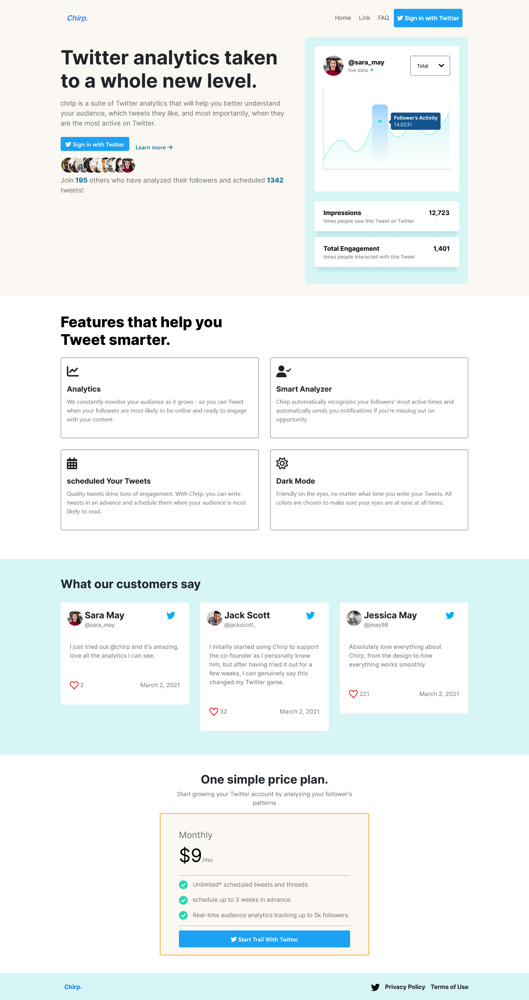
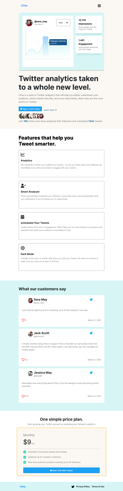
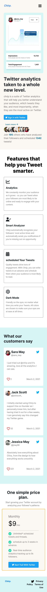

# CodeWell - Chirp.

This is a solution to the [Chirp.](https://www.codewell.cc/challenges/chirp-landing-page--60fc1e36a383e41090a3c71c). CodeWell challenges help you improve your coding skills by building realistic projects.

## Table of contents

- [Overview](#overview)
  - [The challenge](#the-challenge)
  - [Screenshot](#screenshot)
  - [Links](#links)
- [My process](#my-process)
  - [Built with](#built-with)
  - [What I learned](#what-i-learned)
  - [Useful resources](#useful-resources)
- [Author](#author)

## Overview

### The challenge

Users should be able to:

- View the optimal layout for the interface depending on their device's screen size
- See hover and focus states for all interactive elements on the page
- Toggle the tablet & mobile menu

### Screenshot

- Desktop view:



- Tablet view:



- Mobile view:



### Links

- Live Site URL: [Chirp.](https://ibrahim-mohamedh.github.io/chirp/)

## My process

### Built with

- Semantic HTML5 markup
- CSS custom properties
- Bootstrap
- Jquery
  - [fitText](https://github.com/davatron5000/FitText.js)

### What I learned

- Changing Navbar color depending on it's position to match the section's color

```js
$(document).scroll(function () {
  var $nav = $(".fixed-top");
  $nav.toggleClass(
    "sec-1-bg",
    $(this).scrollTop() > 80 &&
      $(this).scrollTop() < $("section").eq(1).offset().top
  );
  $nav.toggleClass(
    "sec-2-bg",
    $(this).scrollTop() > $("section").eq(1).offset().top &&
      $(this).scrollTop() < $("section").eq(2).offset().top
  );
  $nav.toggleClass(
    "sec-3-bg",
    $(this).scrollTop() > $("section").eq(2).offset().top &&
      $(this).scrollTop() < $("section").eq(3).offset().top
  );
  $nav.toggleClass(
    "sec-4-bg",
    $(this).scrollTop() > $("section").eq(3).offset().top
  );
});
```

### Useful resources

- [Stackoverflow](https://stackoverflow.com/questions/7778580/how-to-find-the-vertical-distance-from-top-in-px-of-an-element-using-jquery) - This helped me to get the distance between a section and the top of the page.

```js
$("section").eq([index]).offset().top;
```

## Author

- Website - [Ibrahim-MohamedH](https://github.com/Ibrahim-MohamedH)
- Frontend Mentor - [@Ibrahim-MohamedH](https://www.frontendmentor.io/profile/Ibrahim-MohamedH)
